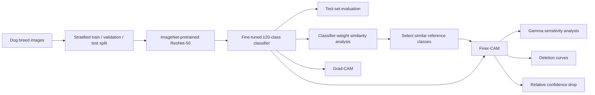
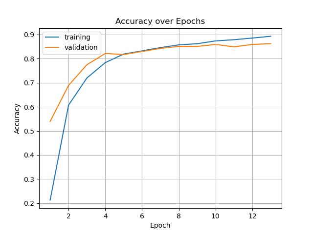
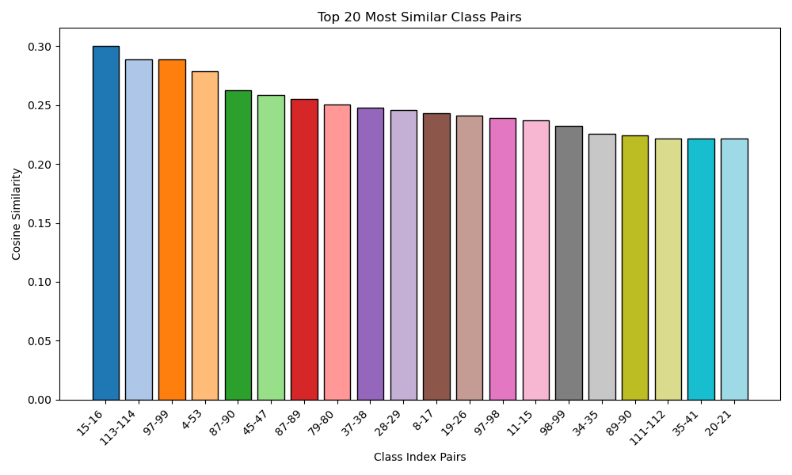
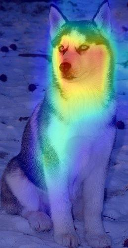
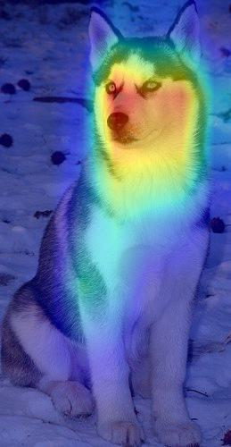
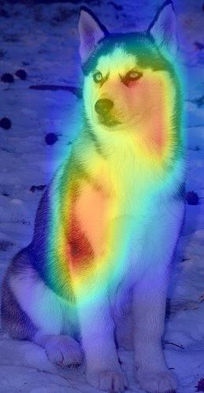
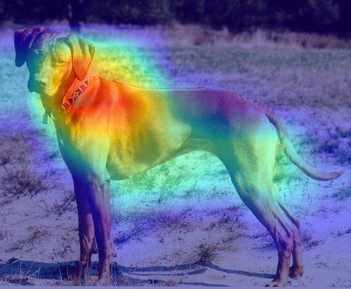
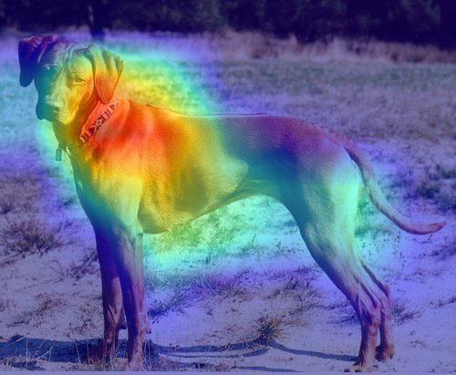
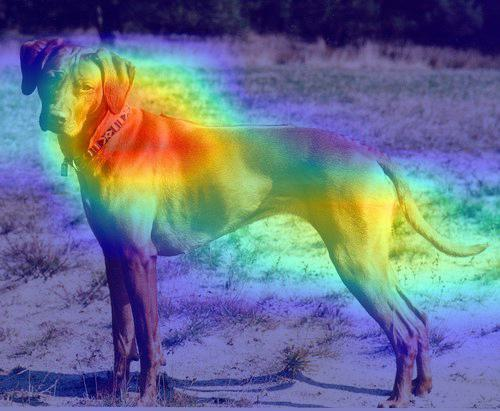
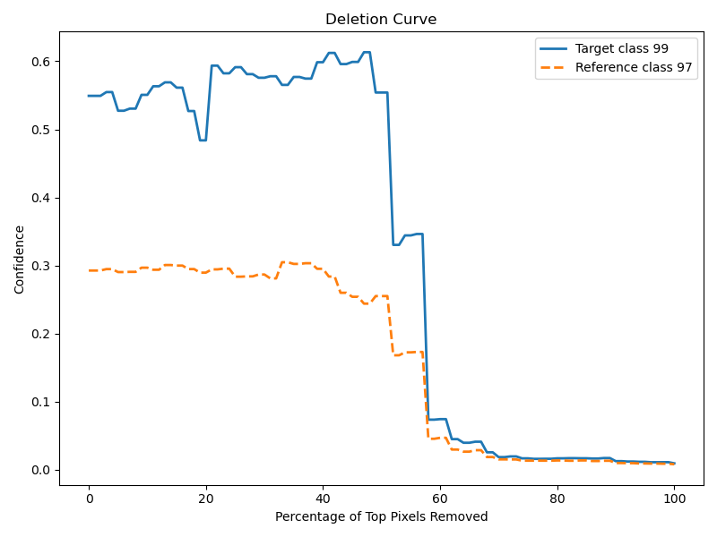

# Finer-CAM for Fine-Grained Visual Explanations

## Introduction

An implementation and exploration of **Finer-CAM**, an explainable AI method designed to reveal the visual details that distinguish highly similar classes.

The project fine-tunes a **ResNet-50** on a 120 class dog-breed classification task and compares standard **Grad-CAM** explanations with **Finer-CAM**. Essentially, rather than asking only _“what supports this class?”_, Finer-CAM introduces a reference class and asks _“what makes this class different from a similar one?”_.

> **Note:** this repository is an educational/research implementation inspired by the original Finer-CAM work. It is not the authors' official implementation. The repository includes the trained checkpoint, evaluation outputs, similarity analyses, and generated explanation maps from the experiments described below.

For a quick overview feel free to check the project **presentation** :point_down:

[](presentation/presentation.pdf)

## Motivation

Class Activation Mapping methods such as Grad-CAM are effective at identifying image regions that support a prediction. A problem arises when different classes share many visualm characteristics: in such cases the classical approach can fail.

This becomes especially relevant in **fine-grained image classification**. A Siberian Husky and an Eskimo Dog, for example, may activate many of the same visual features even though the classifier has learned subtle cues that distinguish them.

Finer-CAM addresses this by explaining a **difference between class scores** rather than a single class score in isolation.

For a target class $c$ and one or more reference classes $d$, this implementation uses:

$$
y_{\text{diff}} = y_c - \gamma \frac{1}{|D|}\sum_{d \in D}y_d
$$

where $\gamma$ controls the strength of the comparison. Gradients of this contrastive objective are then used to construct the activation map.

- $\gamma = 0$ approaches the ordinary target-class explanation.
- Increasing $\gamma$ suppresses features that also support the reference class and emphasizes more discriminative features.
- Multiple reference classes are supported by averaging their logits in the comparison term.

## Pipeline



The project therefore combines **fine-grained classification**, **model uncertainty analysis**, **classifier-weight similarity**, and **post-hoc visual explanation** in a single experimental workflow.

## Dataset and preprocessing

The experiments use the **Stanford Dogs** dataset, which contains **20,580 images from 120 dog breeds**. The class-folder structure used by the code follows the dataset's ImageNet/WordNet-style breed identifiers.

The data are split in a stratified fashion using:

| Split      | Ratio | Approx. samples in this run |
| ---------- | ----: | --------------------------: |
| Training   |   70% |                      14,405 |
| Validation |   10% |                       2,058 |
| Test       |   20% |                       4,117 |

Images are resized to **224 × 224** and normalized with ImageNet statistics. A random horizontal flip is used as training augmentation.

The dataset itself is **not included in this repository** for space reasons. The code expects the following local structure:

```text
data/
├── images/
│   ├── n02085620-Chihuahua/
│   ├── n02085782-Japanese_spaniel/
│   ├── ...
│   └── n02116738-African_hunting_dog/
└── dataloaders/
```

Dataset: <http://vision.stanford.edu/aditya86/ImageNetDogs/>

## Classification model

The visual explanations are generated from a classifier that first needs to reliably distinguish the fine-grained classes.

The project uses an **ImageNet-pretrained ResNet-50**, replacing its final fully connected layer with a 120-class classification head and fine-tuning the full network.

### Training configuration

| Component             | Setting                     |
| --------------------- | --------------------------- |
| Backbone              | ResNet-50                   |
| Initialization        | ImageNet pretrained weights |
| Output classes        | 120                         |
| Input resolution      | 224 × 224                   |
| Loss                  | Cross-entropy               |
| Optimizer             | SGD                         |
| Initial learning rate | 1e-3                        |
| Momentum              | 0.9                         |
| LR scheduler          | ReduceLROnPlateau           |
| Gradient clipping     | 1.0                         |
| Early stopping        | Enabled                     |
| Batch size            | 32                          |
| Split seed            | 15                          |

The training loop records loss, accuracy, weighted precision, recall, and F1 score for the training and validation sets, while preserving the selected checkpoint in `models/checkpoints/`.

### Classification results

The stored test evaluation reports:

| Metric                 | Test score |
| ---------------------- | ---------: |
| **Accuracy**           | **87.59%** |
| **Weighted Precision** | **87.89%** |
| **Weighted Recall**    | **87.59%** |
| **Weighted F1**        | **87.27%** |

The highest logged validation accuracy is approximately **86.98%**.

<p align="center">
  
</p>

Additional learning curves for loss, precision, recall, and F1 score are available under [`results/plots/`](results/plots/).

## From class similarity to explanations

Finer-CAM is particularly interesting when the target class has a visually similar alternative. To identify these relationships, the project extracts the weight vectors of the final linear classifier and computes their pairwise **cosine similarity**.

Some of the most similar learned class pairs are:

| Target / reference pair                  | Cosine similarity |
| ---------------------------------------- | ----------------: |
| Walker Hound ↔ English Foxhound          |             0.300 |
| Toy Poodle ↔ Miniature Poodle            |             0.289 |
| Eskimo Dog ↔ Siberian Husky              |             0.289 |
| Shih-Tzu ↔ Lhasa                         |             0.279 |
| Greater Swiss Mountain Dog ↔ Entlebucher |             0.263 |
| Rhodesian Ridgeback ↔ Redbone            |             0.243 |
| Irish Wolfhound ↔ Scottish Deerhound     |             0.241 |

This analysis motivates the reference classes used in the Finer-CAM case studies rather than comparing arbitrary categories.

<p align="center">
  
</p>

The complete similarity matrix is stored in [`results/plots/similarity_plots/cosine_similarity_matrix.csv`](results/plots/similarity_plots/cosine_similarity_matrix.csv).

## Grad-CAM and Finer-CAM

Both methods are implemented in [`CAM.py`](CAM.py) using forward and backward hooks on the final ResNet convolutional block (`layer4[-1]`).

### Grad-CAM

For Grad-CAM, the gradients of the selected class score are globally averaged and used to weight the target-layer feature maps. The resulting map answers:

> **Which image regions support this class prediction?**

### Finer-CAM

Finer-CAM instead backpropagates through the contrastive class score $y\_{\text{diff}}$. This changes the question to:

> **Which regions support the target class specifically relative to this reference class?**

The implementation also exposes $\gamma$, allowing the comparison strength to be varied without retraining the model.

## Qualitative examples

### Siberian Husky vs. Eskimo Dog

The classifier-weight analysis identifies **Siberian Husky** and **Eskimo Dog** as one of the most similar class pairs in the model.

<table>
<tr>
<td align="center"><b>Grad-CAM: Husky</b></td>
<td align="center"><b>Grad-CAM: Eskimo score</b></td>
<td align="center"><b>Finer-CAM: Husky vs. Eskimo</b></td>
</tr>
<tr>
<td></td>
<td></td>
<td></td>
</tr>
</table>

The two ordinary class explanations overlap substantially, whereas the contrastive Finer-CAM objective changes the activation pattern by suppressing features shared with the reference class and emphasizing features that contribute to their distinction.

### Rhodesian Ridgeback vs. Redbone

<table>
<tr>
<td align="center"><b>Grad-CAM: Ridgeback</b></td>
<td align="center"><b>Grad-CAM: Redbone score</b></td>
<td align="center"><b>Finer-CAM: Ridgeback vs. Redbone</b></td>
</tr>
<tr>
<td></td>
<td></td>
<td></td>
</tr>
</table>

A third case study compares **Irish Wolfhound** with **Scottish Deerhound**, another highly similar pair according to the learned classifier weights. Its visualizations are also available in [`results/visualizations/`](results/visualizations/).

## Effect of the comparison strength

The repository contains Finer-CAM visualizations generated with several values of $\gamma$, including:

$$
\gamma \in \(0.2, 0.4, 0.6, 0.8, 1.0\)
$$

for the main class-pair experiments.

This provides a direct way to inspect the transition from a more general target-class explanation toward an increasingly contrastive explanation focused on differences with the reference class.

Example outputs can be found under:

```text
results/visualizations/*_gamma_0.2.jpg
results/visualizations/*_gamma_0.4.jpg
results/visualizations/*_gamma_0.6.jpg
results/visualizations/*_gamma_0.8.jpg
results/visualizations/*_gamma_1.0.jpg
```


## Explanation evaluation

In addition to visual inspection, the project implements two quantitative/diagnostic tools for studying the generated saliency maps.

### Deletion curves

Pixels are progressively removed in descending CAM-importance order while tracking the classifier confidence. If the explanation correctly identifies important regions, masking its most salient pixels should produce a meaningful drop in the target-class confidence.

The implementation can simultaneously track the target and reference classes, which is particularly useful for contrastive explanations.

<p align="center">
  
</p>

### Relative confidence drop

The project also implements the **Relative Confidence Drop** used in the Finer-CAM work. After masking the most activated CAM regions, it measures how much more the target-class confidence decreases than the reference-class confidence:

$$
RD = \(p_c - p_c^\ast\) - \(p_d - p_d^\ast\)
$$


where $p_c$ and $p_d$ are the original target and reference probabilities, and $p_c^\ast$ and $p_d^\ast$ are the corresponding probabilities after masking.

## Class-level uncertainty analysis

Fine-grained datasets are not equally difficult across classes. The repository therefore also computes per-class:

- test accuracy;
- mean probability assigned to the correct class;
- predictive entropy;
- number of correct predictions.

The resulting table is stored in [`results/class_uncertainty/uncertainty_test.csv`](results/class_uncertainty/uncertainty_test.csv) and is sorted from lower to higher average true-class confidence.

This analysis is useful for identifying particularly difficult or ambiguous breeds before interpreting individual predictions. For example, **Eskimo Dog** is among the most uncertain classes in the stored run, while its classifier representation is also highly similar to **Siberian Husky**, making the pair especially relevant for contrastive explanation.

## Reference

This project is based on the method introduced in:

> Ziheng Zhang, Jianyang Gu, Arpita Chowdhury, Zheda Mai, David Carlyn, Tanya Berger-Wolf, Yu Su, and Wei-Lun Chao. **“Finer-CAM: Spotting the Difference Reveals Finer Details for Visual Explanation.”** arXiv:2501.11309, 2025.

- Paper: <https://arxiv.org/abs/2501.11309>
- Original Finer-CAM repository: <https://github.com/Imageomics/Finer-CAM>

This repository is an **independent educational implementation and experimental study** and is not affiliated with the original Finer-CAM authors.
